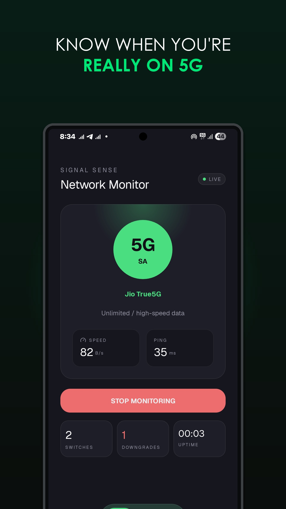
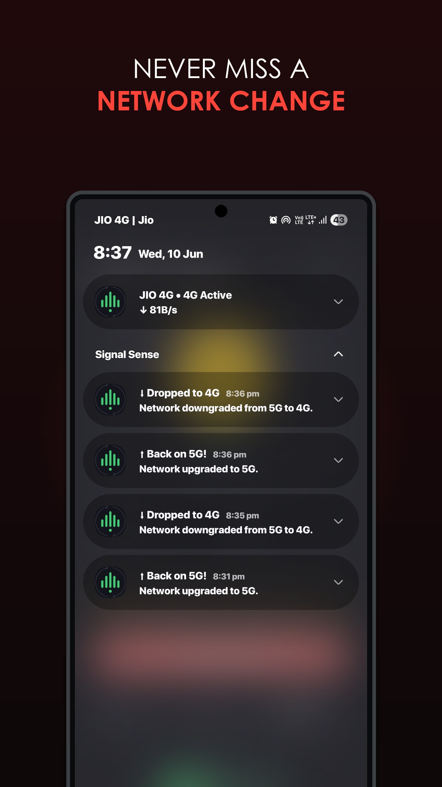
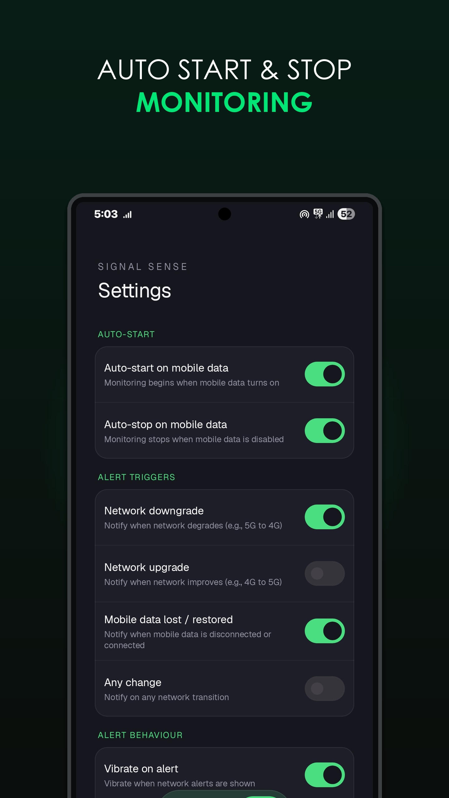
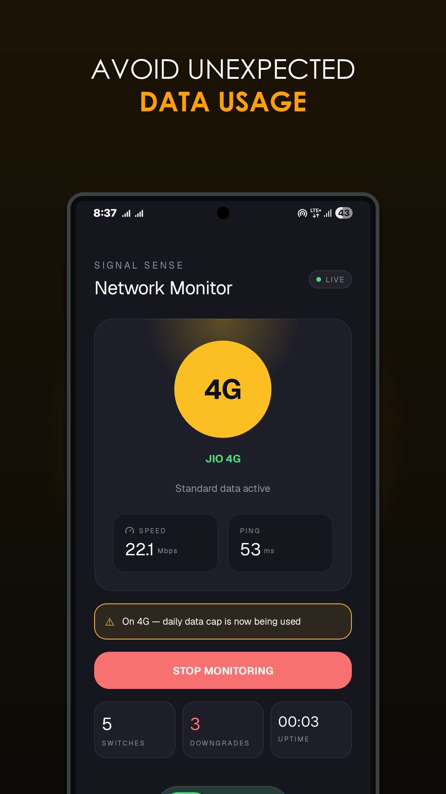
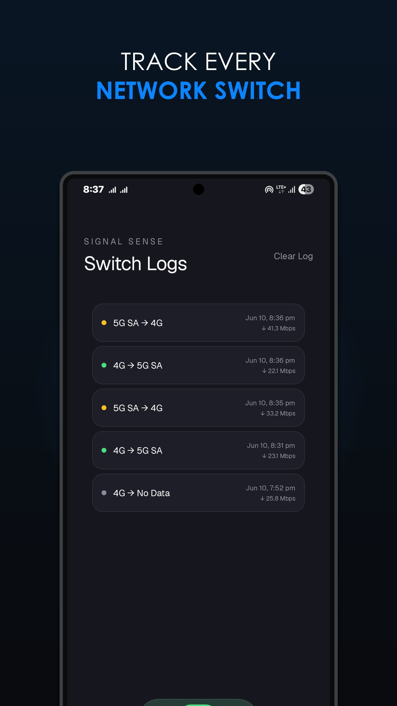
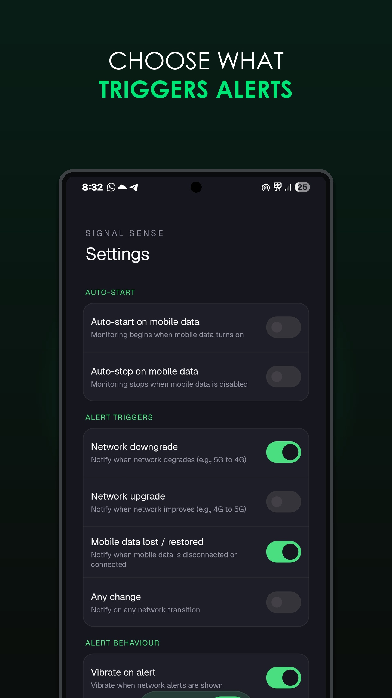

  
   
  <h1>SignalSense</h1>

  
Know the instant your network switches between 5G, 4G, 3G, or 2G

  

    
    
    
  

---

<h2>📡 About SignalSense</h2>

<table align="center" width="100%">
<tr valign="middle">
<td width="60%" align="left">

<b>Frustrated by silent drops from 5G to 4G?</b> 
SignalSense alerts you the instant your network changes – so you're always the first to know.

From live speed tracking, latency measurement, and custom ringtones & vibration control to a full timestamped switch history – every detail is captured.

Set your own alert rules and choose exactly which transitions notify you. Auto start/stop works hands-free with mobile data. Dual SIM support lets you monitor the SIM that matters. Built entirely in Material 3 with a premium dark UI designed for all-day use.

<blockquote>
<b>You can't stop network drops. SignalSense makes sure you know the moment they happen.</b>
</blockquote>

</td>
<td width="40%" align="center">

🛡️ <b>100% Privacy-First</b> <small>No data leaves your device. Zero trackers, zero analytics, zero telemetry. </small>

⚡ <b>Instant Alerts</b> <small>Fired the moment your network changes with vibration and custom notification sounds. </small>

📊 <b>Live Speed & Ping</b> <small>Real-time measured bytes/sec from TrafficStats, plus ICMP/TCP latency. </small>

</td>
</tr>
</table>

<h2>📸 Screenshots</h2>

<table align="center">
  <tr valign="top">
    <td align="center">
      
    </td>
    <td align="center">
      
    </td>
    <td align="center">
      
    </td>
  </tr>
  <tr valign="top">
    <td align="center">
      
    </td>
    <td align="center">
      
    </td>
    <td align="center">
      
    </td>
  </tr>
</table>

<h2>✨ Features</h2>

<table align="center" width="100%">
  <tr valign="top">
    <td width="50%">
      <h3>📡 Network Detection</h3>
      <ul>
        <li><b>5G SA vs NSA:</b> Accurately distinguishes 5G Standalone from Non-Standalone - not just "5G".</li>
        <li><b>Full Generation Support:</b> Detects 5G, 4G LTE, 3G, 2G and No Data states.</li>
        <li><b>Skip Detection:</b> Direction-based ranking catches skips like 5G→3G that pair-based systems miss entirely.</li>
      </ul>
    </td>
    <td width="50%">
      <h3>🔔 Smart Alerts</h3>
      <ul>
        <li><b>Instant Notifications:</b> Heads-up alerts the moment your network transitions.</li>
        <li><b>Custom Ringtone and Vibration Control:</b> Custom ringtone and vibration for all network transitions.</li>
        <li><b>Anti-Spam Debouncing:</b> Unstable signal detection prevents notification spam during rapid oscillations.</li>
        <li><b>Call-Aware Alerts:</b> Suppresses alerts during active phone calls and fires them automatically after the call ends.</li>
      </ul>
    </td>
  </tr>
  <tr valign="top">
    <td width="50%">
      <h3>📊 Live Stats</h3>
      <ul>
        <li><b>Real-time Speed:</b> TrafficStats-based bytes/sec updated every second.</li>
        <li><b>Live Ping:</b> ICMP + TCP latency measurement to 1.1.1.1 / 8.8.8.8.</li>
        <li><b>Uptime Counter:</b> Tracks how long monitoring has been active.</li>
      </ul>
    </td>
    <td width="50%">
      <h3>📋 Switch History</h3>
      <ul>
        <li><b>Full Log:</b> Every network change logged with timestamp, speed, and direction.</li>
        <li><b>Stats:</b> Total switch count and downgrade count at a glance.</li>
      </ul>
    </td>
  </tr>
  <tr valign="top">
    <td width="50%">
      <h3>⚙️ Customizable Triggers</h3>
      <ul>
        <li><b>Upgrade/Downgrade Controls:</b> Toggle alerts for all upgrades or downgrades separately.</li>
        <li><b>Any Change Mode:</b> Alert on every single network transition.</li>
        <li><b>Data Lost/Restored:</b> Dedicated alerts for mobile data dropping or coming back.</li>
      </ul>
    </td>
    <td width="50%">
      <h3>🔄 Auto Start/Stop & Auto-start Boot</h3>
      <ul>
        <li><b>Auto-Start with Data:</b> Monitoring begins the moment mobile data turns on.</li>
        <li><b>Auto-Stop with Data:</b> Monitoring stops automatically when data turns off.</li>
        <li><b>Boot Auto-Start:</b> Optionally start monitoring on every device reboot.</li>
      </ul>
    </td>
  </tr>
  <tr valign="top">
    <td width="50%">
      <h3>📱 Dual SIM Support</h3>
      <ul>
        <li><b>SIM Slot Selector:</b> Choose which SIM to monitor on dual-SIM phones.</li>
        <li><b>Auto Mode:</b> Follows the active data SIM automatically.</li>
        <li><b>Live SIM Switch:</b> Re-attaches listener instantly when default data SIM changes.</li>
      </ul>
    </td>
    <td width="50%">
      <h3>🎨 Premium UI</h3>
      <ul>
        <li><b>Material 3 Dark Theme:</b> Deep navy palette with mint green accents.</li>
        <li><b>Animated Network Badge:</b> Glowing circle that updates with color per generation.</li>
        <li><b>Custom Dock Navigation:</b> Smooth animated pill-shaped tab indicator.</li>
      </ul>
    </td>
  </tr>
</table>

<h2>⚠️ Device Compatibility & Known Limitations</h2>
 
<table align="center" width="100%">
  <tr valign="top">
    <td width="50%">
      <h3>Permissions Required</h3>
      <ul>
        <li><b>READ_PHONE_STATE:</b> Required for accurate 5G SA/NSA detection. Without this, detection falls back to basic network type only.</li>
        <li><b>POST_NOTIFICATIONS:</b> Required on Android 13+ for alerts to appear.</li>
        <li><b>FOREGROUND_SERVICE:</b> Required to monitor in the background while the screen is off.</li>
      </ul>
    </td>
    <td width="50%">
      <h3>OEM Auto-Start</h3>
      
On Samsung, Xiaomi, Realme, OPPO, Vivo, and OnePlus devices — the OS has a separate auto-start manager that may block boot and data auto-start regardless of app settings.

      
If auto-start is not working, manually enable it in your device's battery or app settings for SignalSense.

    </td>
  </tr>
  <tr valign="top">
    <td width="50%">
      <h3>Wi-Fi Behaviour</h3>
      
SignalSense only monitors cellular/mobile network transitions. If your phone is connected to Wi-Fi, the cellular auto-start trigger will not fire until mobile data becomes the active connection.

    </td>
    <td width="50%">
      <h3>5G NSA Detection</h3>
      
Some devices report 5G NSA as LTE at the OS level. SignalSense handles this correctly and labels it as 5G (NSA) — but detection accuracy depends on your device's telephony implementation.

    </td>
  </tr>
</table>

 

  <table border="0" cellpadding="15" cellspacing="0" width="85%">
    <tr>
      <td align="center">
        <h2>💖 Support the Project</h2>
        
If SignalSense has helped you stay in control of your connection, consider supporting development. Your support keeps this app free, open-source, and actively maintained.

         
        
        &nbsp;
        
        &nbsp;
        
         
      </td>
    </tr>
  </table>

 

<h2 id="install">📲 Download/Install</h2>

  
Choose your preferred installation method

&nbsp;&nbsp;

&nbsp;&nbsp;

&nbsp;&nbsp;

&nbsp;&nbsp;

<h2>🤝 Contributing</h2>

Contributions are very welcome! Whether it's bug reports, feature suggestions, or code contributions:

<ol>
  <li>Fork the repository</li>
  <li>Create your feature branch (<code>git checkout -b feature/AmazingFeature</code>)</li>
  <li>Commit your changes (<code>git commit -m 'Add some AmazingFeature'</code>)</li>
  <li>Push to the branch (<code>git push origin feature/AmazingFeature</code>)</li>
  <li>Open a Pull Request</li>
</ol>

<h2>🛡️ Privacy & Data Collection</h2>

At <strong>SignalSense</strong>, your privacy is a core principle, not an afterthought.

<ul>
  <li><strong>Zero Data Collection:</strong> We do <strong>not</strong> collect, store, or transmit any personal information, usage habits, or network history.</li>
  <li><strong>100% Local:</strong> All switch logs, settings, and preferences are stored exclusively on your device.</li>
  <li><strong>No Tracking:</strong> No hidden trackers, no analytics SDKs, no background telemetry of any kind.</li>
  <li><strong>Open Source:</strong> Every line of code is publicly auditable - you don't have to take our word for it.</li>
</ul>

<h2>📜 License</h2>

This project is licensed under the <strong>GNU General Public License v3.0</strong>. 
<small>&copy; 2026 Adithya Mittapally &nbsp;•&nbsp; See the <a href="LICENSE">LICENSE</a> file for full details.</small>

<h3>💬 Community & Support</h3>

Found a bug? Have a feature idea? Want to discuss the app?

  

  

  

    
⭐ <strong>Star this repo if you found SignalSense useful!</strong>

    
Made with ❤️ by <a href="https://github.com/adithya-creation">Adithya Mittapally</a>

  

